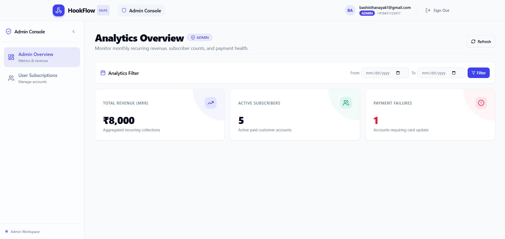
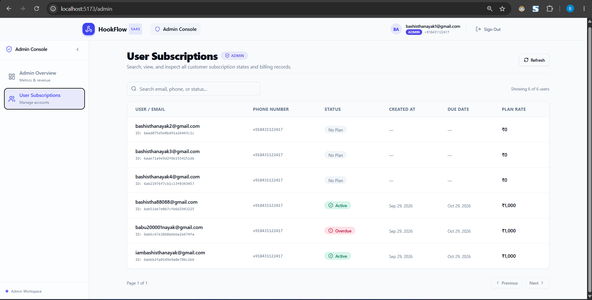
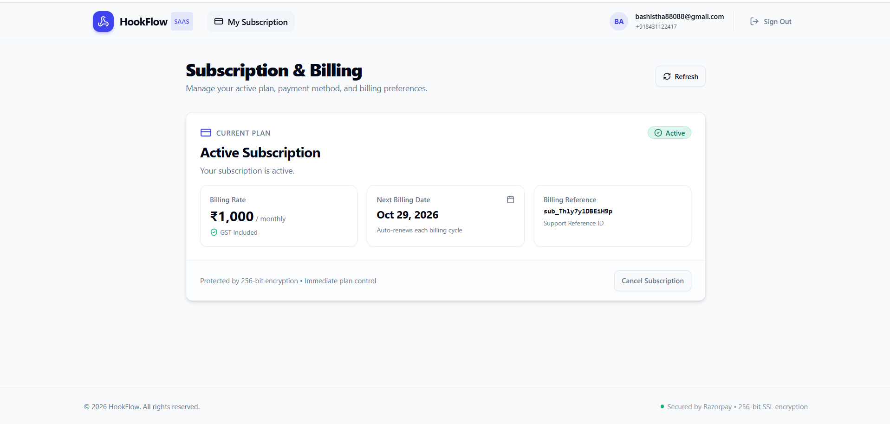
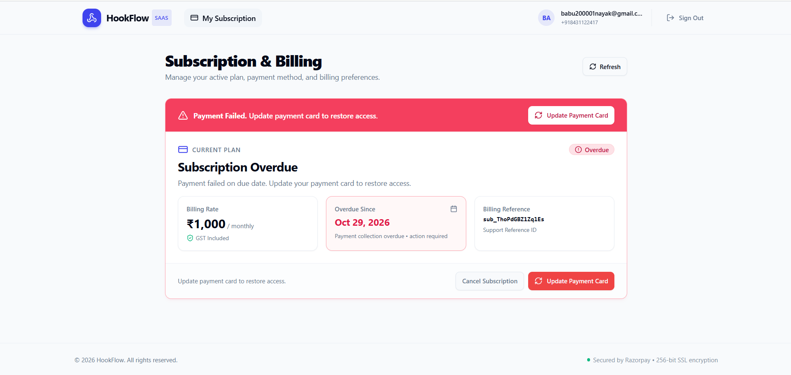
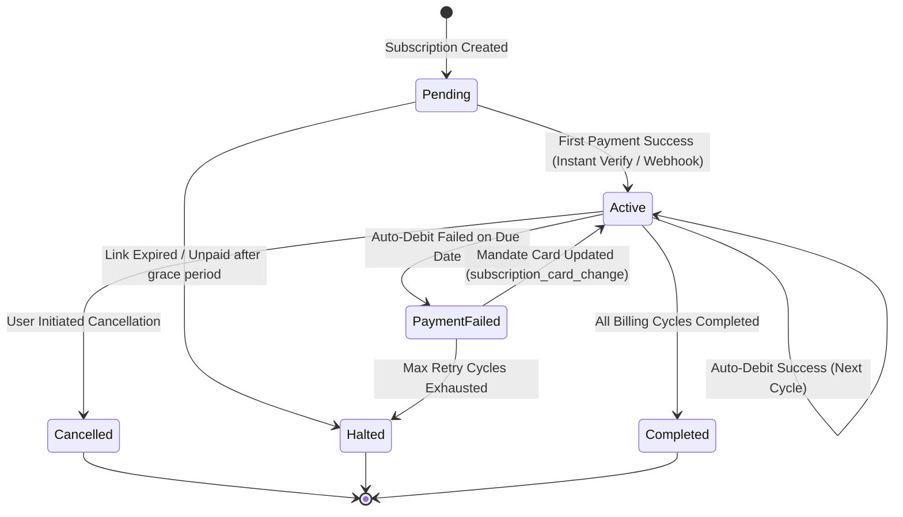

# ⚡ HookFlow Dashboard

> **Enterprise-grade SaaS Subscription Management & Payment Orchestration Engine** built with React 18, TypeScript, Tailwind CSS, TanStack Query, and Razorpay e-Mandate integration.

[](https://hookflow-dashboard.vercel.app)
[](https://react.dev/)
[](https://www.typescriptlang.org/)
[](https://tailwindcss.com/)
[](https://tanstack.com/query)
[](https://razorpay.com/)

---

## 📌 Executive Summary

**HookFlow** is a production-ready subscription billing dashboard designed to solve the critical challenges of recurring SaaS billing, asynchronous webhook delays, and automated dunning/failure recovery. 

Unlike basic CRUD payment apps, HookFlow implements a **resilient dual-verification model** (instant synchronous verification backed by asynchronous webhook reconciliation) and handles complex subscription lifecycle transitions (`Active`, `Pending`, `PaymentFailed`, `Halted`, `Cancelled`, `Completed`, `Paused`) in compliance with RBI e-mandate and recurring payment guidelines.

---

## 🚀 Live Demo & Access

- **Live URL**: [https://hookflow-dashboard.vercel.app](https://hookflow-dashboard.vercel.app)
- **Role Support**: Integrated Role-Based Access Control (**Customer** & **Admin** consoles).

---

## 📸 Platform Screenshots

### 1. Admin Analytics & Revenue Command Center
*Real-time MRR analytics, active subscriber tallies, payment failure counters, and custom date range filters.*


---

### 2. Admin User Subscriptions Audit Table
*Granular subscription inspection with real-time search, plan rate auditing, due date tracking, and IST-formatted timestamps.*


---

### 3. Customer Active Subscription View
*Clean customer billing self-service portal displaying active mandate status, billing cycles, GST-inclusive pricing, and one-click cancellation.*


---

### 4. Smart Dunning & Mandate Recovery (Payment Failed / Overdue)
*Automated grace period & mandate recovery flow allowing users to update their payment method (`subscription_card_change`) without duplicating subscription records.*


---

## 💡 Key Architectural Highlights & Engineering Challenges Solved

### 1. Synchronous Verification with Webhook Eventual Consistency
- **Problem**: Traditional webhook-only payment flows suffer from 15–30+ minute network or queue delays before granting users access, causing high cart abandonment and customer confusion.
- **Solution**: HookFlow implements an **instant verification handshake (`POST /api/subscriptions/verify`)** triggered directly from the Razorpay checkout success handler. This queries Razorpay's API in real time, activates the user immediately in the DB, and avoids user drop-off, while webhooks serve as the resilient eventual-consistency backbone for background recurring charges.

### 2. Intelligent Dunning & Mandate Card Update Flow
- **Problem**: When a recurring monthly debit fails, naive systems cancel the subscription and force the customer to purchase a new one. This clutters the database with orphan subscriptions and violates recurring billing continuity.
- **Solution**: HookFlow leverages Razorpay's `subscription_card_change: 1` mandate recovery protocol. When a subscription enters `PaymentFailed`, the user is prompted to link a fresh payment card to their **existing** subscription mandate. An automated polling engine checks for invoice clearance and webhook confirmation seamlessly.

### 3. Role-Based Access Control (RBAC) & Persistent Auth State
- Strict route protection (`<ProtectedRoute />` and `<AdminRoute />`) preventing unauthorized access to financial metrics or user subscription logs.
- Client authentication state synchronized between memory (Zustand) and `localStorage` with automated token attachment via Axios request interceptors.

### 4. Resilient Cache & State Management
- Built on **TanStack React Query v5** with query invalidation patterns (`useQueryClient`), preventing stale billing states.
- Configured with custom retry algorithms that immediately discard retry cycles on `401`, `403`, and `404` errors to prevent redundant network chatter.

---

## ⚡ Core Features

### 👤 Customer Experience (Self-Service Billing)
- **One-Click Recurring Subscription**: Seamless authorization of recurring monthly mandates (e.g., ₹1,000/month) with auto-prefilled user details.
- **Instant Access Activation**: Immediate UI transition to `Active` status via real-time post-checkout verification.
- **Card Update Flow**: Effortlessly recover failed auto-debits without re-registering or paying duplicate initial fees.
- **Self-Service Cancellation**: Graceful subscription cancellation backed by interactive Radix UI confirmation dialogs.
- **Subscription Metadata**: Real-time display of next billing date, reference IDs, and GST breakdown.

### 🛡️ Administrator Command Center
- **Executive Revenue Metrics**:
  - **MRR (Monthly Recurring Revenue)**: Dynamically calculated based on active paid accounts.
  - **Active Subscribers**: Real-time tally of healthy, active customer mandates.
  - **Payment Failures**: Instant flag for delinquent accounts needing automated recovery.
- **Date-Range Analytics Filter**: Filter financial metrics by custom start and end dates.
- **User Subscription Audit Directory**:
  - Full-text search across user emails, phone numbers, and statuses.
  - Indian Standard Time (IST) timestamp tracking for when subscriptions were initiated.
  - Dynamic status badges reflecting precise state (`Active`, `Overdue`, `Cancelled`, `No Plan`).
  - Responsive desktop table and mobile-optimized card layout.

---

## 🛠️ Tech Stack & Ecosystem

| Layer | Technologies |
|---|---|
| **Core Framework** | [React 18](https://react.dev/) + [Vite](https://vitejs.dev/) + [TypeScript 5](https://www.typescriptlang.org/) |
| **Styling & UI** | [Tailwind CSS](https://tailwindcss.com/), [Radix UI](https://www.radix-ui.com/) Primitives, [Lucide React](https://lucide.dev/) |
| **State & Data Fetching** | [TanStack React Query v5](https://tanstack.com/query), [Zustand](https://zustand-demo.pmnd.rs/), [Axios](https://axios-http.com/) |
| **Payment Gateway** | [Razorpay Subscriptions & Mandates API](https://razorpay.com/docs/payments/subscriptions/) |
| **Feedback & Notifications**| [Sonner](https://sonner.emilkowal.ski/) (Rich toasts) |
| **Routing & Protection** | [React Router DOM v6](https://reactrouter.com/) |
| **Deployment & Hosting** | [Vercel](https://vercel.com/) |

---

## 📂 Project Directory Structure

```text
hookflow-dashboard/
├── public/
│   ├── Active_subscrption.png            # Customer active dashboard preview
│   ├── Admin_Analytics_Overview.png      # Admin KPI analytics preview
│   ├── Admin_user_subscrptions_list.png  # Admin user audit table preview
│   └── Overdue_auto_debit_failed.png     # Dunning / Mandate update preview
├── src/
│   ├── api/
│   │   ├── admin.ts                      # Admin stats and user list endpoints
│   │   ├── auth.ts                       # Login, register, and token management
│   │   ├── axios.ts                      # Configured Axios client with interceptors
│   │   └── billing.ts                    # Subscription link, verify, and cancel APIs
│   ├── components/
│   │   ├── admin/
│   │   │   ├── StatsCards.tsx            # KPI stat cards for MRR & subscriber metrics
│   │   │   └── UsersTable.tsx            # Responsive user subscriptions table & search
│   │   ├── auth/
│   │   │   ├── AdminRoute.tsx            # Guard verifying ADMIN role
│   │   │   └── ProtectedRoute.tsx        # Guard ensuring user authentication
│   │   ├── dashboard/
│   │   │   ├── AdminDashboardView.tsx    # Admin tabs, date filters, and views
│   │   │   ├── CancelModal.tsx           # Radix dialog for cancellation confirmation
│   │   │   ├── CustomerDashboardView.tsx # Customer main subscription overview
│   │   │   ├── PayNowButton.tsx          # Razorpay SDK initialization & prefill logic
│   │   │   ├── StatusBadge.tsx           # Dynamic color-coded status pills
│   │   │   └── SubscriptionCard.tsx      # Core billing card with card-update flows
│   │   ├── layout/
│   │   │   ├── Header.tsx                # Top navigation and user profile summary
│   │   │   └── Sidebar.tsx               # Collapsible navigation sidebar
│   │   └── shared/
│   │       └── ErrorBoundary.tsx         # React runtime error boundary
│   ├── hooks/
│   │   ├── useAdminStats.ts              # TanStack hook for revenue metrics
│   │   ├── useAdminUsers.ts              # TanStack hook for user table pagination
│   │   └── useSubscription.ts            # TanStack hook for subscription lifecycle
│   ├── pages/
│   │   ├── AdminDashboardPage.tsx        # Admin route container
│   │   ├── DashboardPage.tsx             # Customer route container
│   │   ├── LoginPage.tsx                 # Authentication login screen
│   │   ├── RegisterPage.tsx              # User registration screen
│   │   └── NotFoundPage.tsx              # 404 handler
│   ├── store/
│   │   └── authStore.ts                  # Zustand auth state + localStorage sync
│   ├── types/
│   │   └── index.ts                      # Comprehensive TypeScript interfaces
│   ├── App.tsx                           # QueryClient provider, router, & toasts
│   └── main.tsx                          # React entry point
├── .env                                  # Environment variables
├── package.json                          # Dependencies and scripts
├── tailwind.config.js                    # Tailwind styling configuration
└── vite.config.ts                        # Vite bundler configuration
```

---

## ⚙️ Local Development & Setup

### Prerequisites
- **Node.js**: v18.0.0 or higher
- **npm** or **yarn**

### 1. Clone the Repository
```bash
git clone https://github.com/BASHISTHANAYAK/hookflow-dashboard.git
cd hookflow-dashboard
```

### 2. Install Dependencies
```bash
npm install
```

### 3. Configure Environment Variables
Create a `.env` file in the root directory:
```env
VITE_API_BASE_URL=http://localhost:4000
VITE_RAZORPAY_KEY_ID=your_razorpay_key_id
```

### 4. Run Development Server
```bash
npm run dev
```
Open your browser at `http://localhost:5173`.

### 5. Production Build
```bash
npm run build
```

---

## 🔄 Subscription Lifecycle State Machine



---

## 👨‍💻 Author

**Bashistha Nayak**  
- **GitHub**: [@BASHISTHANAYAK](https://github.com/BASHISTHANAYAK)  
- **Live Application**: [hookflow-dashboard.vercel.app](https://hookflow-dashboard.vercel.app)

---

## 📄 License
This project is licensed under the [MIT License](LICENSE).
